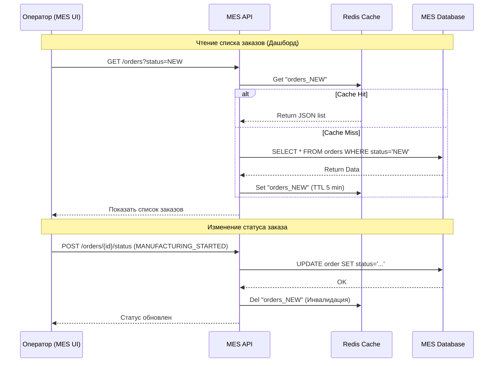

# Мотивация

**Проблема:** Операторы MES жалуются на долгую загрузку первой страницы (дашборда) со списком заказов. Даже внедрение пагинации не помогло. Это происходит из-за того, что при каждом обновлении страницы система выполняет тяжелые SQL-запросы к единственному инстансу БД, который одновременно занят записью новых заказов от API и расчетами.

**Цели кеширования:**

1. **Снижение нагрузки на MES db:** Уменьшение количества идентичных запросов на чтение списка заказов по статусам.
2. **Улучшение пользовательского опыта (UX):** Мгновенная загрузка дашборда для операторов, что критично для их мотивации (кто первый взял заказ, тот получил оплату).
3. **Обеспечение масштабируемости:** Подготовка системы к дальнейшему росту заказов от API без деградации скорости интерфейса.

**Что кешируем:**

* Список заказов с фильтрацией по статусам (для дашборда MES).
* Справочные данные (цены на материалы, типы изделий), которые редко меняются, но участвуют в расчетах.

---

# Предлагаемое решение

Предлагаю внедрить **серверное кеширование** на стороне **MES API** с использованием распределенного хранилища (например, Redis).

**Почему серверное?** Клиентское кеширование (в браузере) здесь неэффективно: операторам нужно видеть *актуальные* заказы, созданные другими системами (API, Shop) в реальном времени. Серверный кеш позволит отдавать данные мгновенно любому оператору сразу после того, как заказ попал в систему.

### Выбор паттерна: Cache-Aside

**Почему именно он:**

1. **Гибкость:** Приложение само решает, что и когда кешировать. Если кеш-сервер (Redis) упадет, система продолжит работу напрямую с БД (хоть и медленнее), что обеспечивает отказоустойчивость.
2. **Оптимальность для «Александрита»:** У нас много разных фильтров на дашборде. Кешировать всё заранее (Refresh-Ahead) слишком ресурсозатратно, а Write-Through усложнит логику записи, которая и так нагружена расчетами 3D-моделей.

| Паттерн | Почему не подходит / Хуже |
| --- | --- |
| **Write-Through** | Увеличивает задержку (latency) при создании заказа, так как нужно ждать записи в БД и в кеш одновременно. В условиях 30-минутных расчетов это лишнее усложнение. |
| **Refresh-Ahead** | Сложно предсказать, какие именно фильтры выберет оператор. Мы будем тратить ресурсы на обновление кеша, который никто не посмотрит. |

### Диаграмма последовательности (Sequence Diagram)

### Стратегия инвалидации кеша

Предлагаю комбинированную стратегию: **Инвалидация по ключу (программная) + TTL (временная)**.

* **Программная (по событию):** Как только статус заказа меняется (например, оператор взял его в работу), MES API удаляет из кеша записи, соответствующие старому и новому статусу. Это гарантирует, что другие операторы сразу увидят актуальную картину.
* **TTL (Time-To-Live):** Установка времени жизни кеша (например, 5-10 минут) как «страховка», если программная инвалидация не сработает из-за сбоя.

**Почему не другие?**

* *Только TTL:* 5-10 минут ожидания обновления дашборда — это слишком долго для операторов, соревнующихся за заказы.
* *Инвалидация всего кеша:* Слишком дорого. При изменении одного заказа нет смысла сбрасывать кеш справочников или заказов в других статусах (например, SHIPPED).

---

## 3. Сравнение вариантов (Дополнительное задание)

| Решение 1: Cache-Aside (Redis) | Решение 2: In-Memory Cache (внутри MES API) |
| --- | --- |
| **Описание:** Данные хранятся в отдельном сервисе Redis. | **Описание:** Данные хранятся в оперативной памяти самого приложения .NET. |
| **Плюсы:** Кеш общий для всех будущих инстансов MES API (масштабируемость). Данные не теряются при перезагрузке приложения. | **Плюсы:** Максимальная скорость (нет сетевых задержек). Простота реализации (не нужен новый сервис). |
| **Минусы:** Требует настройки и поддержки отдельного компонента (Redis). Сетевые расходы на запрос к кешу. | **Минусы:** При перезагрузке инстанса кеш пустеет. Не подходит, если мы запустим 2+ инстанса MES API (рассинхрон данных). |

**Заключение:**
Для «Александрита» я рекомендую **Решение 1 (Redis)**. Несмотря на чуть большую сложность, оно позволяет компании масштабироваться линейно. Поскольку сейчас каждый сервис крутится в одном инстансе, но планируется активный рост, использование внешнего кеша избавит нас от проблем с расхождением данных (Inconsistency) при добавлении новых серверов в облаке.